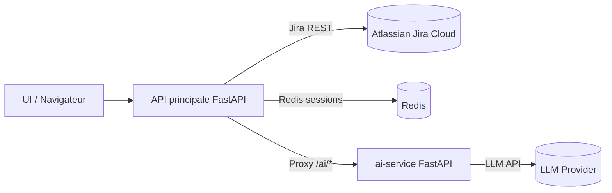

# Depot

[](https://github.com/Alibenhaddou/Depot/actions/workflows/tests.yml)
[](https://github.com/Alibenhaddou/Depot/actions/workflows/security.yml)
[](https://github.com/Alibenhaddou/Depot/actions/workflows/docker-image.yml)
[](https://sonarcloud.io/summary/new_code?id=Alibenhaddou_Depot)
[](https://sonarcloud.io/summary/new_code?id=Alibenhaddou_Depot)

## Description

JiraVision est un service FastAPI utilisé pour démonstration / POC autour d'intégrations Atlassian, LLMs et sessions.

## Architecture (vue rapide)



## Tests et couverture

## Démarrage rapide (dev)

1) Copier la configuration d'exemple :

```bash
cp JiraVision/.env.example JiraVision/.env
```

2) Lancer l'app (avec Redis) :

```bash
cd JiraVision
docker-compose up --build
```

3) Ouvrir l'UI : http://localhost:8000

- Lancer la suite de tests :

```bash
cd JiraVision
pytest -q
```

- Pour utiliser le `ai-service` externe (migration progressive), exportez la variable d'environnement :

```bash
export AI_SERVICE_URL="http://ai-service:8000"
```

Avec `AI_SERVICE_URL` configurée, l'application principale fera un proxy des appels `/ai/*` vers le service externe (utile pour tests et migration canary).

### Observabilité (optionnel)

Pour activer le tracing OpenTelemetry (API principale + ai-service), configurez :

```bash
export OTEL_EXPORTER_OTLP_ENDPOINT="http://otel-collector:4318/v1/traces"
```

Les métriques Prometheus sont exposées sur `/metrics` pour les deux services.
- Générer le rapport de coverage HTML et XML :

```bash
cd JiraVision
pytest --cov=app --cov-report=xml:coverage.xml --cov-report=html:htmlcov -q
```

- Consulter le rapport HTML localement (option simple) :

```bash
# partir du repo racine
python -m http.server --directory JiraVision/htmlcov 8000
# ouvrir http://localhost:8000 dans votre navigateur
```

> Astuce pour les tests : si vous rencontrez l'avertissement Starlette "Setting per-request cookies is being deprecated", définissez les cookies sur l'instance `TestClient` :

```py
client.cookies.set("sid", "value")
client.cookies.set("oauth_state", "xyz")
res = client.get("/some/path")
```

## Contribution

- Suivez la convention de style (Black), vérifiez `flake8` et `mypy` avant d'ouvrir une PR.
- Les workflows GitHub Actions exécutent les tests et génèrent la couverture automatiquement.
