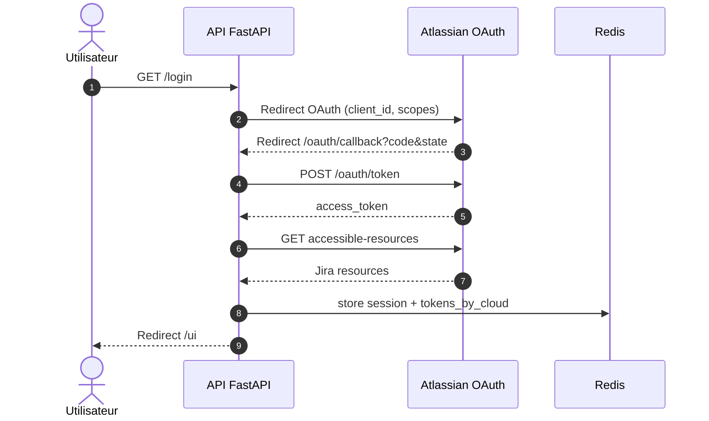
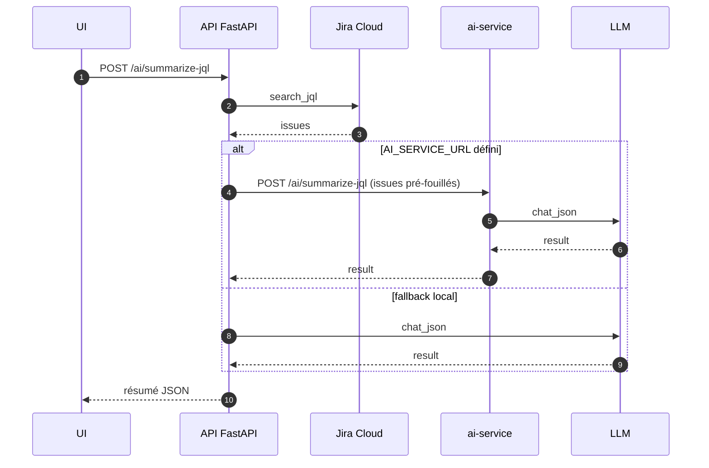
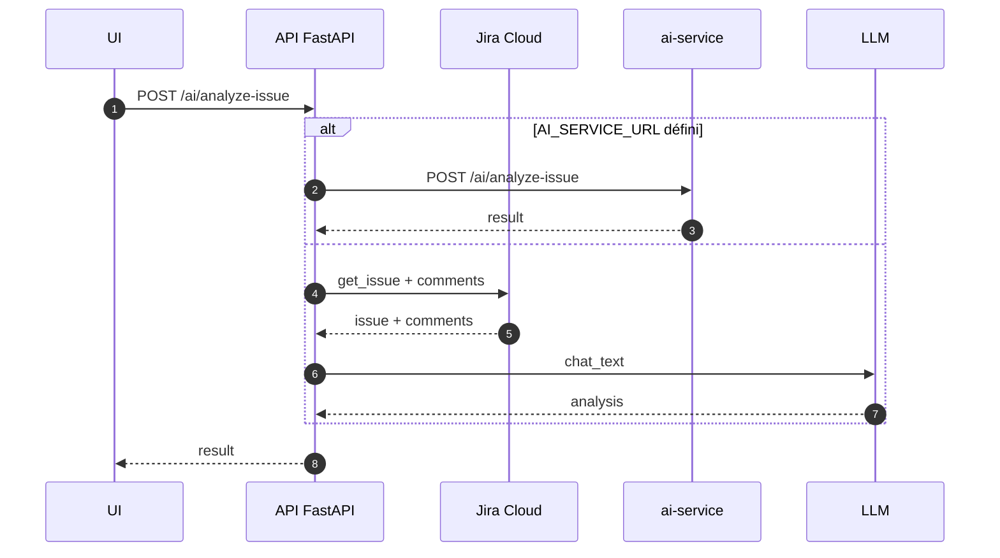
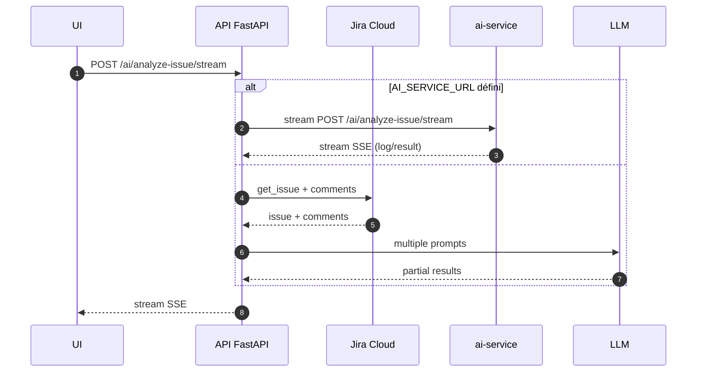

# Architecture technique

## Objectif
Décrire le **design technique**, les composants, les flux, les contrats et les choix structurants.

## Composants principaux

- **API FastAPI** (service `api`) : logique métier, OAuth Atlassian, orchestration Jira, proxy IA.
- **ai-service** : microservice IA dédié (proxy LLM, auth inter-service, métriques, tracing).
- **Redis** : sessions utilisateur et cache (fallback mémoire en dev).
- **Ollama** (par défaut) ou **OpenAI** : fournisseur LLM.
- **Jira Cloud** : source des données (issues, commentaires, etc.).

## Découpage logique (modules)

### API principale

- `app/main.py` : composition FastAPI, routing, metrics, static UI, OpenTelemetry.
- `app/routes/*` : endpoints (auth, jira, ai, ui, debug).
- `app/clients/*` : Jira, LLM, ai-service proxy.
- `app/auth/session_store.py` : gestion des sessions signées + Redis.
- `app/core/*` : config, redis, token inter-service, telemetry.

### ai-service

- `ai_app/main.py` : app FastAPI, metrics, health, telemetry.
- `ai_app/routes/ai.py` : endpoints IA.
- `ai_app/clients/llm.py` : client LLM.
- `ai_app/core/auth.py` : auth inter-service.

## Flux techniques majeurs

### 1) OAuth Atlassian (connexion)

### 2) Summarize JQL

### 3) Analyze Issue (sync)

### 4) Analyze Issue (stream SSE)

## Authentification inter-service

- L’API génère un **token signé** (`itsdangerous`) avec `AI_SHARED_SECRET`.
- `ai-service` vérifie la signature et la TTL (`AI_TOKEN_TTL_SECONDS`).
- Si `AI_AUTH_ENABLED=false`, le service accepte les appels sans token.

## Sessions & stockage

- Cookie `sid` **signé** côté client.
- Session persistée en Redis sous clé `session:{sid}`.
- TTL glissant basé sur `SESSION_MAX_AGE_SECONDS`.
- Fallback en mémoire locale si Redis indisponible (dev only).

## Observabilité

- Metrics Prometheus : `/metrics` (API + ai-service).
- Tracing OpenTelemetry : activé si `OTEL_EXPORTER_OTLP_ENDPOINT` défini.
- Instrumentation FastAPI + HTTPX pour traces distribuées.

## Gestion des erreurs (principes)

- 401 : utilisateur non connecté / token expiré / auth inter-service invalide.
- 404 : ticket Jira introuvable.
- 502 : dépendance externe indisponible (Jira/LLM/ai-service).

## Evolution & modularité

- Le service IA est conçu pour être **externalisé** sans changer l’API publique.
- Le proxy `/ai/*` permet une migration progressive et du canary.
- Ajout futur recommandé : base de données par service (schéma dédié ou DB dédiée).- UI conforme RGAA (panel Projets PO) : tablist/tab/tabpanel, roving tabindex, navigation clavier, aria-live.
## Journal des évolutions

| Date | Version | Description | Auteur | Référence |
|------|---------|-------------|--------|-----------|| 2026-01-19 | US-20 | Ajout note conformité RGAA UI (panel Projets PO). | | PR #42 || 2026-01-16 | initial | Documentation de l’architecture technique. | | |
