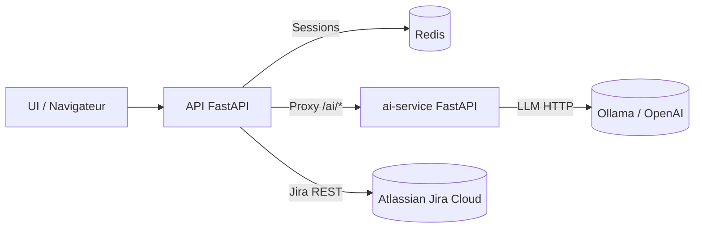

# Infrastructure applicative

## Objectif
Décrire **l’infrastructure d’exécution** de JiraVision, ses services déployés, ses dépendances et la configuration nécessaire pour fonctionner en local / dev / staging.

## Topologie (vue rapide)

## Services déployés (docker-compose)

| Service | Image/Build | Conteneur | Ports | Rôle |
|--------|------------|-----------|-------|------|
| api | build: . | ct_api | 8000:8000 | API principale FastAPI |
| redis | redis:7 | ct_redis | 6379:6379 | Sessions / cache |
| ai-service | build: ./services/ai_service | ct_ai_service | 8001:8000 | Microservice IA |
| ollama | ollama/ollama:latest | ct_ollama | 11434:11434 | Provider LLM local |

> Source: docker-compose.yml

## Réseau

- Réseau Docker par défaut de Compose (bridge).
- Les services se résolvent par leur **nom de service** (`redis`, `ai-service`, `ollama`).

## Stockage

| Volume | Utilisation |
|--------|-------------|
| ollama | Persistance des modèles LLM |

## Exposition externe

- **API principale** : `http://localhost:8000`
- **ai-service** : `http://localhost:8001`
- **Ollama** : `http://localhost:11434`

## Configuration applicative

Fichier d’exemple : `.env.example` (copié en `.env`).

### Variables principales (API)

- `ATLASSIAN_CLIENT_ID`
- `ATLASSIAN_CLIENT_SECRET`
- `ATLASSIAN_REDIRECT_URI`
- `ATLASSIAN_SCOPES`
- `APP_SECRET_KEY`
- `ENABLE_POC_UI` (true/false)
- `ENABLE_DEBUG_ROUTES` (true/false)
- `REDIS_HOST` / `REDIS_PORT`
- `AI_SERVICE_URL`
- `AI_AUTH_ENABLED`
- `AI_SHARED_SECRET`
- `AI_TOKEN_TTL_SECONDS`
- `LLM_PROVIDER`, `LLM_BASE_URL`, `LLM_MODEL`, `LLM_TIMEOUT`
- `OPENAI_API_KEY`, `OPENAI_MODEL` (si provider OpenAI)
- `OTEL_EXPORTER_OTLP_ENDPOINT` (tracing)

### Variables principales (ai-service)

- `AI_AUTH_ENABLED`
- `AI_SHARED_SECRET`
- `AI_TOKEN_TTL_SECONDS`
- `LLM_PROVIDER`, `LLM_BASE_URL`, `LLM_MODEL`, `LLM_TIMEOUT`
- `OPENAI_API_KEY`, `OPENAI_MODEL`
- `OTEL_EXPORTER_OTLP_ENDPOINT`

## Déploiement local (dev)

1. Copier le fichier d’exemple :
   - `.env.example` → `.env`
2. Lancer :
   - `docker-compose up --build`
3. Ouvrir :
   - UI : `http://localhost:8000`

## Observabilité

### Metrics (Prometheus)

- API : `/metrics`
- ai-service : `/metrics`

### Tracing (OpenTelemetry)

Activé **uniquement** si `OTEL_EXPORTER_OTLP_ENDPOINT` est défini.

## Sécurité & secrets

- Les secrets sont fournis **exclusivement** via `.env` ou variables d’environnement.
- **Ne jamais** committer `.env`.
- `APP_SECRET_KEY` et `AI_SHARED_SECRET` doivent être **longs** et **aléatoires**.

## Résilience / dégradations connues

- Si Redis est indisponible, la session bascule temporairement en **mémoire locale** (dev only).
- Si `AI_SERVICE_URL` est configurée : l’API devient **proxy** pour `/ai/*`.
- Si LLM indisponible : réponses en erreur 502 sur endpoints IA.

## Évolutivité

Stratégie recommandée pour faire évoluer l’infra :
- Isoler chaque service dans son **propre déploiement** (K8s / ECS),
- Utiliser **un schéma DB par service** si ajout de stockage persistant,
- Ajouter un **gateway**/ingress si l’exposition externe s’élargit.

## Journal des évolutions

| Date | Version | Description | Auteur | Référence |
|------|---------|-------------|--------|-----------|
| 2026-01-16 | initial | Documentation de l’infrastructure applicative. | | |
